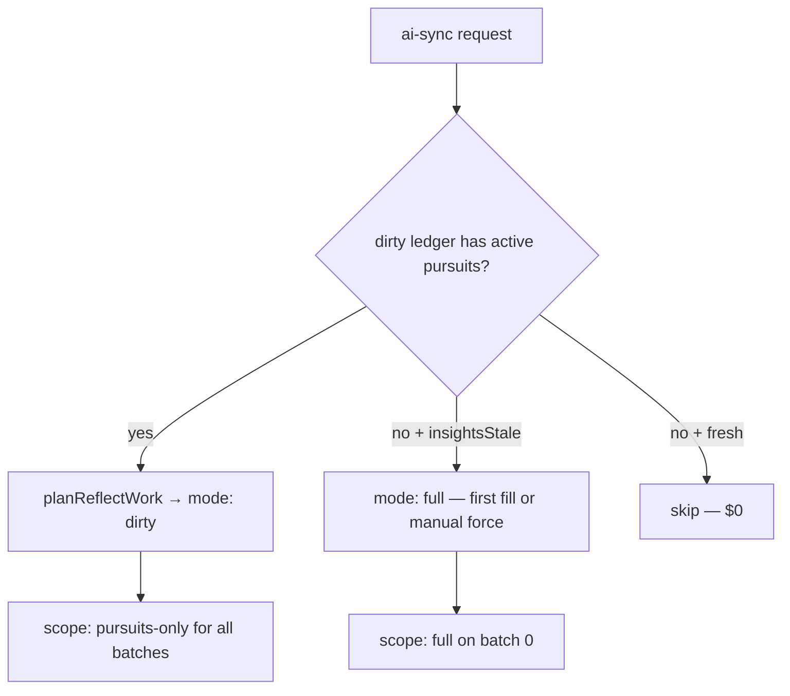

# AI sync Phase 2 — incremental cost decoupling (design only)

**Status:** Design doc — not implemented. Phase 1 (foreground-only background sync) shipped 2026-07-04.

**Problem:** Today almost every reading refresh is a **full whole-map regeneration**, even when only one chapter changed. Token cost scales with `(sync frequency) × (full map size)` instead of `(sync frequency) × (changed chapters)`.

**Goal:** Route automatic syncs through the existing **dirty-only / `pursuits-only`** path so token cost stays flat as refresh frequency increases. Reserve full-map theme synthesis for manual refresh or periodic cadence.

---

## Current behavior (why full regen always wins)

Key code paths:

| Step | File | Behavior |
|------|------|----------|
| Version hash | [`compute-map-version.ts`](../src/lib/insights/compute-map-version.ts) | Global `maxUpdatedAt` across all goals |
| Stale check | [`ai-sync.ts`](../src/lib/map/ai-sync.ts) | `insightsStale = mapVersion !== cache.mapVersion` |
| Work plan | [`reflect-sync-plan.ts`](../src/lib/ai/reflect-sync-plan.ts) | `insightsStale \|\| force` → `mode: "full"` |
| Scope per batch | [`generate-reflect.ts`](../src/lib/ai/generate-reflect.ts) | Batch 0 = `full`; later batches = `pursuits-only` |
| Trimmed context | [`buildPursuitsOnlyMapContext`](../src/lib/ai/generate-reflect.ts) | Dirty chapters + same-category siblings only |

The trimmed path **exists** but is unreachable for normal edits because `insightsStale` always forces `mode: "full"`.

---

## Proposed architecture

### A. Split "cache drift" from "regeneration scope"

Introduce two distinct concepts:

1. **Cache drift** — should mobile show stale UI? (can remain mapVersion-based)
2. **Regeneration scope** — which chapters/themes need Gemini work? (dirty-ledger-based)

**Changes:**

- [`reflect-sync-plan.ts`](../src/lib/ai/reflect-sync-plan.ts): Prefer `mode: "dirty"` when `dirty.activeDirtyPursuitIds.length > 0`, even if `insightsStale`. Reserve `mode: "full"` for: no cache, manual `force: true`, global dirty (`hasGlobal`), archive/delete events, or `shouldUseFullReadingRefresh` threshold (>35% dirty).
- [`ai-sync.ts`](../src/lib/map/ai-sync.ts): After partial dirty sync, update per-chapter insight cache without requiring whole-map `mapVersion` match on insight row — or store a separate `lastReflectAt` / per-pursuit version stamp.
- Mobile stale UI: continue using `canAutoRefresh` / client edit timestamps; do not require full regen to clear "waiting" state for unchanged chapters.

### B. Theme synthesis cadence

Per-chapter panel updates do not require re-generating all six theme `oneLiner`s on every edit.

| Trigger | Theme synthesis |
|---------|-----------------|
| Single chapter note edit | Skip theme regen; update pursuit panel only |
| Chapter added/archived | Full or theme-scoped regen |
| Manual pull with force | Full regen |
| Periodic (e.g. daily) | Optional full regen for cross-theme connections |

Implementation: pass `themeIds: []` for edit-only dirty batches (`isEditOnlyDirtyBatch` already exists in [`reading-dirty-ledger.ts`](../src/lib/map/reading-dirty-ledger.ts)).

### C. Gemini context caching

The dominant input cost is re-sending `<map_context>` JSON on every call (~40–80k chars on a 12-chapter map).

**Approach:**

1. Split reflect prompt into **stable prefix** (system prompt + map context skeleton) and **variable suffix** (dirty pursuit IDs, focal facts, reading packet delta).
2. Use Gemini **context caching** (or explicit cache tokens) for the stable prefix keyed by `(userId, mapContextHash)`.
3. Invalidate cache when structural map changes (add/archive chapter, category move) — not on every field edit.

**Files to touch:**

- [`generate-reflect.ts`](../src/lib/ai/generate-reflect.ts) — prompt assembly
- [`ai-client.ts`](../src/lib/ai-client.ts) — cache create/reuse API
- New: `map-context-cache-key.ts` — hash of pursuit IDs + titles + statuses (exclude volatile fields like notes for cache key, include notes in delta block)

**Expected savings:** 60–80% input token reduction on incremental syncs where map skeleton is unchanged.

---

## Mobile implications (Phase 2b — optional)

Phase 1 intentionally does **not** wire edit-triggered debounce. Phase 2b could add it **only after** incremental backend path is live:

- Call `scheduleDebouncedAiSync()` from `invalidateInsightsAfterMapEdit` (or mutation success handlers)
- Increase debounce to 60–90s to coalesce editing sessions
- Safe because each sync would cost proportional to dirty chapters, not full map

---

## Success metrics

| Metric | Phase 1 baseline | Phase 2 target |
|--------|-------------------|----------------|
| Input tokens per single-chapter edit sync | ~10–20k (full map) | ~2–5k (dirty + siblings) |
| `reflectFullCalls` per auto sync | 1+ | 0 for edit-only |
| Estimated USD per typical session | ~$0.004 | ~$0.001 |
| Reading freshness | Foreground auto | Same or edit-triggered (2b) |

Monitor via [`log-ai-sync-cost.ts`](../src/lib/map/log-ai-sync-cost.ts) — compare `reflectFullCalls` vs `reflectScopedCalls` and `mapContextChars` before/after.

---

## Implementation order (recommended)

1. **Backend:** `planReflectWork` dirty-first routing + edit-only theme skip
2. **Backend:** Partial cache version stamps (per-pursuit or dirty-ledger clear without full mapVersion bump)
3. **Backend:** Context caching for stable map prefix
4. **Mobile:** Wire edit-triggered debounce (Phase 2b) only after (1–3) verified in prod logs
5. **Docs:** Update cost model with observed Phase 2 savings

---

## Risks

| Risk | Mitigation |
|------|------------|
| Stale cross-theme connections after incremental sync | Periodic full regen or explicit "refresh all" manual path |
| Theme oneLiner drift | Regenerate themes when `hasGlobal` or on manual force |
| Cache invalidation bugs | Fallback to full regen when cache miss or hash mismatch |
| UX confusion (partial update) | Reading tab shows "Updated {N} chapters" or timestamp per section |

---

## Out of scope for Phase 2

- Instantaneous per-keystroke sync
- Relaxing delivery cadence or call caps
- Removing pull-to-refresh entirely
