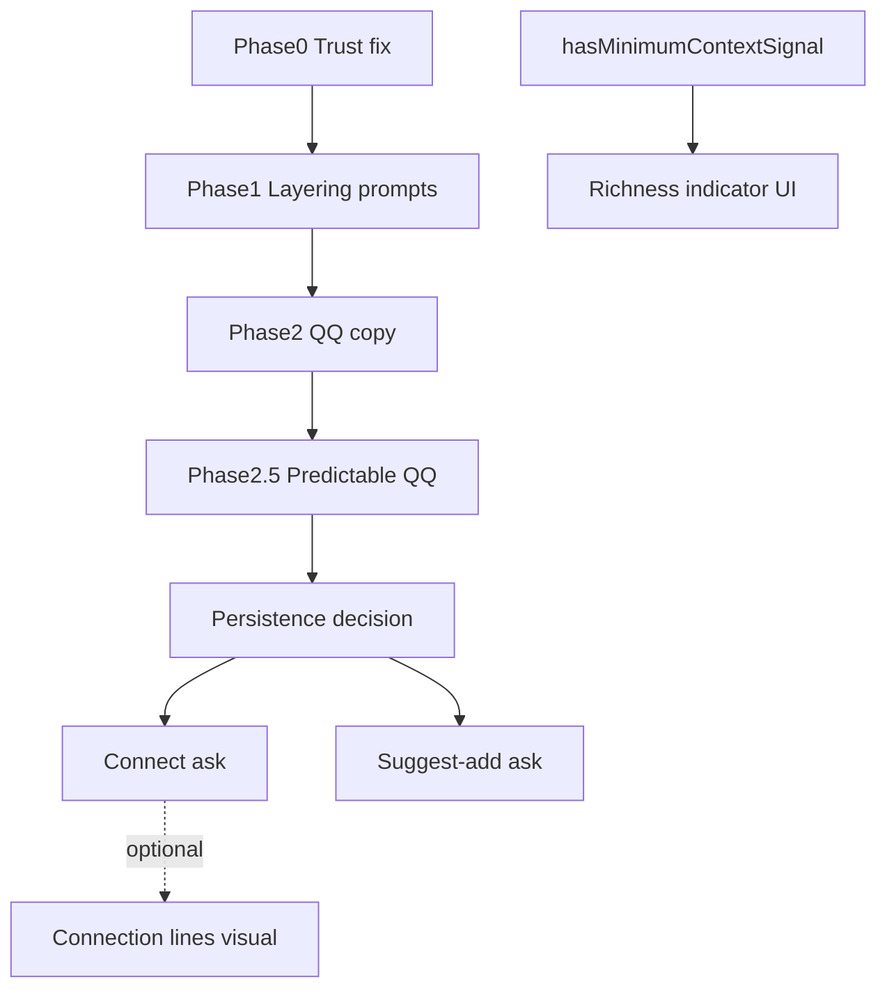

# Insight roadmap plan

**Status:** Sequenced plan (2026-06-19)  
**Pre-TestFlight bundle:** Phase 0–2 (prompt + copy only) — **shipped**; Phase 0 verified on production  
**V2:** Unified Question Mechanism — post-validation (see below)

**Design concept:** [`QUESTION-MECHANISM.md`](./QUESTION-MECHANISM.md)

---

## Dependency graph

| Phase | Depends on | Blocks |
|-------|------------|--------|
| P0 CeMAP fix | Nothing | — |
| Layering cleanup | P0 (same files) | Trustworthy Reading |
| Phase 2 QQ clarity | Nothing critical | — |
| **Phase 2.5 Predictable QQ** | Phase 2 | Connect, Suggest-add UX trust |
| **Persistence decision** | Phase 2.5 (recommended) | Connect, Suggest-add |
| **Connect ask** | Persistence decision | Optional lines renderer |
| **Suggest-add ask** | Persistence decision | — |
| Richness indicator UI | Existing signals | — (adjacent) |
| Connection lines | Connect data + product confirm | — (adjacent, may never) |

---

## Pre-TestFlight (shipped)

| Phase | Effort | Schema? | Scope |
|-------|--------|---------|--------|
| **0 Trust fix** | S | No | Arrival disambiguation, retraction, packet thinning |
| **1 Layering** | M | No | Panorama vs execution in `STORY_PROMPT_BASE` |
| **2 QQ clarity** | S | No | Settings/hint copy, optional cache prune |

---

## V2 — Unified Question Mechanism (feasibility audit)

**Date:** 2026-06-19  
**Design doc:** [`QUESTION-MECHANISM.md`](./QUESTION-MECHANISM.md)

### Verdict

The mechanism unifies **three interpretive asks** behind one user gesture (quiet MC card on pursuit sheet):

| Ask | Status | Confirm handler |
|-----|--------|-----------------|
| **Clarify** | Shipped (`clarifyTitles`) | `POST …/clarifier-answers` → `enrichAnswers` + `description` append |
| **Connect** | Prompt stub only (`suggestConnections`, default off) | **Not built** — today writes prose only; needs structured store |
| **Suggest-add** | Not in repo | **Not built** — must open `PlacementCreateSheet` prefilled, never auto-place |

**One gesture, three handlers** — not one persistence pipeline.

**Cursor opinion:** this is a product improvement only while the boundary stays narrow. Treat the shared question card as the UX simplification, not as a reason to collapse storage or renderers. Recommended default: Context Log before new asks; typed peer relationship for Connect; Suggest-add opens normal create with optional provenance; connection lines stay unbuilt unless confirmed data later proves they help.

**Do not absorb** into this mechanism (adjacent, separate surfaces):

| Idea | Verdict | Why |
|------|---------|-----|
| Milestone suggestions | **Adjacent** | Different UX (chips on sheet); same philosophy, different component (`suggestedMilestones` in enrich cache) |
| Connection lines | **Adjacent / visual gate** | No edge model or line renderer; data may come from Connect ask; lines may never ship |
| Significance-as-gravity | **Adjacent / upstream** | Sort key for *which* pursuit gets the next question slot — not a card type |
| Richness indicator | **Adjacent / read-only** | `hasMinimumContextSignal` already gates readings; UI meter is founder-confirm, design parked |

Forcing all six original ideas into the QQ pathway would **increase** complexity. Three merge; four stay separate.

---

### Part 1 — Current code ground truth

**Clarify pipeline (shipped)**

- Settings → `quick-questions-preferences.ts` → `ai-sync` body → `generate-pursuit-enrich.ts` / `apply-reflect-output.ts`
- Clarifiers land in `InsightCache.pursuitInsights[id].clarifiers`
- Mobile: `PursuitClarifiersSection.tsx` → `postClarifierAnswer` → `apply-clarifier-answers.ts`
- Answered clarifiers hidden from cache; readings marked stale

**Connect stub (not real relationships)**

- `suggestConnections: true` allows at most **one** cross-pursuit MC in enrich prompt (`generate-pursuit-enrich.ts` connection rules)
- Answer still goes through clarifier path → `description` prose line
- Prompt explicitly forbids asserting links as fact in Reading/insight prose unless map structure supports it
- **No** `PursuitRelationship` table; **no** `peerGoalId` on `enrichAnswers`; only legacy `parentGoalId` (continuation, not peers)

**Suggest-add (absent)**

- `suggestedContinuations`, `createdFrom` — **not in repo**
- `suggestedMilestones` is within-pursuit steps only
- Theme `combined` forward prose exists but does not drive create flow

**Richness (backend only)**

- `hasMinimumContextSignal` in `pursuit-enrich-readiness.ts` — gates theme contextual/combined, milestone suggestions, Context insight tone
- No pursuit-sheet UI meter

**Batching / ordering**

- `MAX_ENRICH_PER_RUN = 1` — one pursuit enriched per sync pass
- `sortDirtyPursuitIdsForReflect` — significance → thinness → deadline → age (`reading-dirty-ledger.ts`)
- `gateEnrichResult` — strips clarifiers when `clarifyTitles` off, or when description non-empty **and** `hasMinimumContextSignal` true

**Key files**

| Area | File |
|------|------|
| Enrich prompt + cap | `pathfinder/src/lib/pursuit/generate-pursuit-enrich.ts` |
| Clarifier gate | `pathfinder/src/lib/pursuit/pursuit-enrich-readiness.ts` |
| Answer persistence | `pathfinder/src/lib/pursuit/apply-clarifier-answers.ts` |
| Dirty priority sort | `pathfinder/src/lib/map/reading-dirty-ledger.ts` |
| Mobile card | `pathfinder-mobile/components/pursuit/PursuitClarifiersSection.tsx` |
| Settings toggles | `pathfinder-mobile/components/settings/SettingsQuickQuestions.tsx` |

---

### Part 2A — Suggest-add provenance (open)

If user accepts "add apply for mortgage broker roles?" after completing CeMAP:

| Option | Pros | Cons |
|--------|------|------|
| **`createdFrom` on `Goal`** | Continuous-life narrative; compiler can cite succession | Schema + create API + mobile prefill; must not violate no-AI-on-create |
| **Provenance in context log only** | Lighter schema | Harder to query for map-level "what opened from what" |
| **No provenance** | Simplest | Loses explicit life-thread signal |

**Constraint:** suggestion is post-sync question only; create remains user-authored with locked theme + category.

---

### Part 2B — Persistence paths (founder decision — gates Connect + Suggest-add)

Clarifier answers today append to overwrite-prone `Goal.description` (`apply-clarifier-answers.ts`). Decisions Log §6 fences **Pursuit Context Log** as first post-TestFlight backend project for this reason.

| Path | Clarify | Connect | Suggest-add |
|------|---------|---------|-------------|
| **A — Context log canonical** | Log entries; `description` derived/display | Log entry or typed edge table | Create only; optional log entry |
| **B — Type-specific stores** | `enrichAnswers` (today) | `PursuitRelationship` or typed `enrichAnswers` | Create flow only |
| **C — Hybrid** | Migrate clarify to log; connect gets edge table | Edge table | Create + optional `createdFrom` |

**Connect sub-options** (if structured):

1. Typed `enrichAnswers` entry `{ kind: "relationship", peerGoalId, … }` — smallest schema change; weak for map queries
2. Minimal `PursuitRelationship` (userId, goalA, goalB, kind, confirmedAt) — peers, not trees; best for readings compiler
3. Context-log entries only — aligns with log project; query cost higher

**Recommendation from audit:** decide Path A/B/C **before** Connect or Suggest-add implementation. Connect cannot stay as description prose if map should "know" the link.

---

### Part 2C — Connection lines (separate visual gate)

Even with connection **data**, lines are a renderer decision:

- Conflicts with constellation-not-graph north star
- No map code draws pursuit↔pursuit edges today
- **Data valuable without lines** — readings and theme synthesis can use confirmed relationships
- May never ship; do not block Connect ask on lines

---

### Phase 2.5 — Predictable Quick Questions (schema-free)

**Goal:** Clarify ask feels intentional, not random — foundation before Connect/Suggest-add.

| Item | Status | Notes |
|------|--------|-------|
| Clarifier gate aligned with `hasMinimumContextSignal` | **Shipped** | Replaced hidden 120-char / 3-answer off-switch (`gateEnrichResult`) |
| Significance-aware dirty pursuit ordering | **Shipped** | `sortDirtyPursuitIdsForReflect` |
| Completion-boost in selection | **Shipped** | `compareDirtyPursuitPriority` — recent COMPLETE (90d) before thinness |
| Question *type* selection (clarify vs connect vs suggest) | **Not shipped** | Model still picks clarifier copy at enrich time |
| Sync → questions UX clarity | **Shipped** | Insights footer + pursuit-sheet why-now cue (`quickQuestionWhyNowCue`) |
| Frequency tuning | **Not shipped** | `MAX_ENRICH_PER_RUN = 1` caps cost; user-legible cadence TBD with testers |

**Remaining Phase 2.5 (if continuing):** deterministic question *type* slot picker before model drafts MC copy; frequency tuning with TestFlight testers.

---

### Locked-decision conflicts

| Decision | At-risk work |
|----------|--------------|
| Peers-not-trees | Connect store shape, relationship prose |
| No AI on create | Suggest-add must be confirm → prefilled create |
| Replace-not-merge description | Clarify persistence, context log |
| Locked taxonomy | Suggest-add prefill must resolve valid theme + category |
| Richness indicator parked | Thread E UI |
| Constellation not graph | Connection lines |
| AI authorship axiom (Decisions Log §4) | All three asks — ask only, user confirms |

---

### Recommended build order (post-validation)

1. **Finish Phase 2.5** (if TestFlight feedback warrants) — completion-boost, explainability; schema-free  
2. **Founder: persistence decision** (Part 2B) — blocks Connect + Suggest-add  
3. **Connect ask** — structured relationship on confirm; no lines  
4. **Suggest-add ask** — COMPLETE beat → MC → prefilled create; optional `createdFrom` (Part 2A)  
5. **Adjacent, independent:** richness indicator UI (founder confirm); connection lines (may never)

**Do not trap pre-TestFlight work behind V2 feature work.**

---

## Part 4 — Deferred: true-overlay tutorial (late pre-launch)

**Why deferred:** Screens are still moving (Build-here flow, AI work). Highlights anchored to UI break on every change; there is no stable coordinate system today (`measureInWindow` screen coords vs canvas coords inside an animated camera).

**Future spec (do not build now):**

- **`TutorialAnchorRegistry`:** Screens register `{ step, rect }`; coach reads the registry instead of per-component measurement.
- **Proven arc:** Prefilled education pursuit from onboarding → complete → pursuit insight → Insights pull-to-refresh → Reading; real-pursuit prompt as post-tutorial handoff.
- **Conventional coachmark overlay on the real app** — last pre-launch build once screens are stable.

**Current interim (2026-06-19):** Beat-based coach + hard **Skip tutorial** escape; no anchor registry. Crash loop on sheet/read beats stabilized via once-per-beat entry guards and anchor dedupe.

---

## Legacy thread index (superseded labels)

Older briefs used threads A–E. Mapped to current plan:

| Old thread | New home |
|------------|----------|
| A — Connection lines | Adjacent visual gate (Part 2C) |
| B — Suggested continuations | Suggest-add ask (inside mechanism) |
| C — Context vs insight merge | Separate IA decision; collides with persistence decision |
| D — Quick Questions | Clarify ask + Phase 2.5 |
| E — Richness indicator | Adjacent UI |
